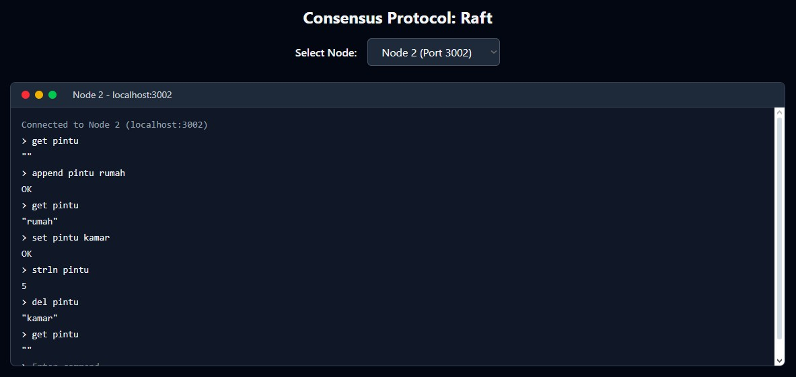

# Consensus Protocol: Raft</h1>

> Repository Tugas Besar 1 IF3130 - Sistem Paralel dan Terdistribusi

<h3>Screenshot</h3>

<h2>Teknologi yang Digunakan</h2>
<ul>
  <li>Node.js</li>
  <li>Express.js</li>
  <li>JSON-RPC</li>
  <li>Docker & Docker Compose</li>
  <li>React, HTML, CSS, Tailwind</li>
</ul>

<h2>Cara Menjalankan</h2>
  <ol>
    <li>Clone repository ini: <code>git clone https://github.com/labsister21/tugas-besar-sister-kalintang99</code></li>
    <li>Masuk ke folder: <code>cd tugas-besar-sister-kalintang99/src</code></li>
    <li>Jalankan dengan Docker Compose: <code>docker compose up --build</code></li>
    <li>Akses aplikasi di <code>http://localhost:5173</code></li>
  </ol>

 <h2>Penjelasan Raft Consensus Protocol</h2>

<h3>1. Heartbeat</h3>

 Heartbeat adalah pesan kosong yang dikirim secara berkala oleh pemimpin (leader) kepada pengikut (follower) untuk menunjukkan bahwa pemimpin masih aktif. Jika follower tidak menerima heartbeat dalam waktu tertentu, mereka akan menganggap leader telah gagal dan memulai proses pemilihan pemimpin baru.

<h3>2. Election</h3>

 Election terjadi ketika follower tidak menerima heartbeat dari leader. Setiap follower akan meningkatkan term mereka dan menjadi kandidat untuk pemilihan. Kandidat akan mengirimkan permintaan suara (RequestVote RPC) kepada node lainnya. Node dengan mayoritas suara akan menjadi leader baru.

<h3>3. Log Replication</h3>

 Setelah menjadi leader, node akan menerima perintah dari klien dan menyebarkannya ke follower melalui RPC <code>AppendEntries</code>. Setiap log entry akan direplikasi ke semua node sebelum dianggap committed dan diterapkan ke state machine.

<h3>4. Membership Change</h3>

 Raft mendukung perubahan anggota kluster (untuk tugas ini hanya mendukung penambahan anggota cluster).

<h3>5. Log Compaction <strong>(BONUS)</strong></h3> 

 Untuk mencegah log menjadi terlalu besar, Raft menggunakan teknik snapshot untuk menyimpan ringkasan state terakhir. Log lama yang telah diterapkan dapat dihapus setelah snapshot dibuat, menghemat ruang penyimpanan dan mempercepat recovery.

<h2>Penulis</h2>
<table>
  <thead>
    <tr>
      <th>Nama</th>
      <th>NIM</th>
    </tr>
  </thead>
  <tbody>
    <tr>
      <td>Maulana Muhamad Susetyo</td>
      <td>13522127</td>
    </tr>
    <tr>
      <td>Andi Marihot Sitorus</td>
      <td>13522136</td>
    </tr>
    <tr>
      <td>Ahmad Rafi Maliki</td>
      <td>13522137</td>
    </tr>
  </tbody>
</table>
